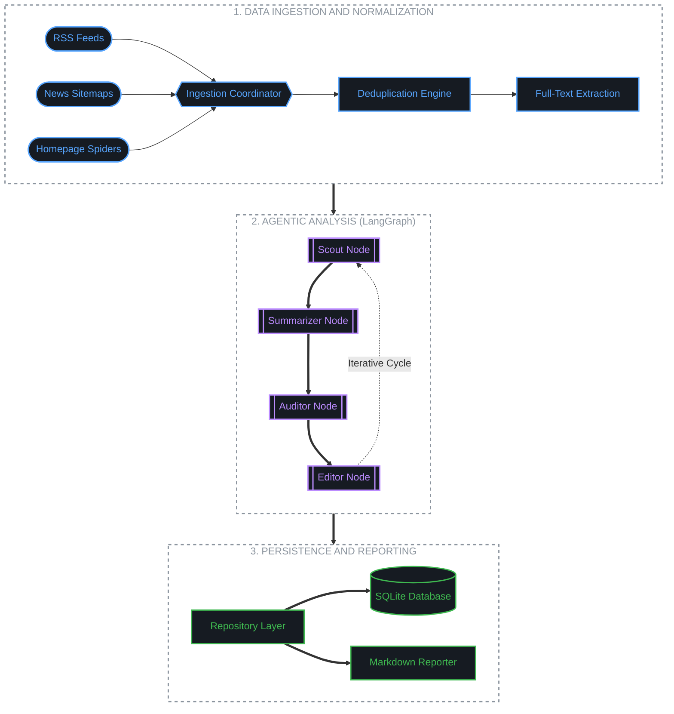

# Unbiased India News

Unbiased India News is a production-grade, agentic AI news aggregation and analysis platform focused on the Indian media landscape. The system operates as an automated daily batch pipeline that fetches, clusters, analyzes, and summarizes national news stories to reveal ideological framing and publisher bias.

---

## System Architecture Map




---

## Technical Component Registry

| Layer         | Component            | Technology        | Responsibility                                       |
| :------------ | :------------------- | :---------------- | :--------------------------------------------------- |
| **Ingestion** | Parallel Coordinator | asyncio / aiohttp | Concurrent fetching across triple-track discovery.   |
|               | Full-Text Extractor  | trafilatura       | Heuristic cleaning and extraction of article bodies. |
| **Analysis**  | Matchmaker           | fastembed (ONNX)  | Cross-lingual semantic clustering (Multilingual-E5). |
|               | Agent Graph          | langgraph         | State machine orchestration and loop control.        |
|               | Summarizer           | gemini-1.5-flash  | High-volume, neutral 3-bullet summarization.         |
|               | Auditor              | gemini-1.5-pro    | Ideological auditing using ownership metadata.       |
| **Storage**   | Checkpointer         | AsyncSqliteSaver  | State persistence for crash recovery and resume.     |
|               | Repository           | sqlalchemy        | Decoupled data access layer for relational storage.  |
|               | Cache                | SQLiteCache       | Persistence of LLM responses to reduce API costs.    |

---

## Real-World Output Sample

Below is an example of a processed news cluster:

### Story: GST Council Meeting on Rate Rationalization

- **Overall Bias Score:** -0.35 (Center-Left Leaning)
- **Coverage Status:** Balanced Coverage Detected

#### AI Generated Summary

- The GST Council reached a consensus on reducing tax slabs for essential health insurance premiums and medical equipment.
- Opposition-led states requested a further reduction in the standard 18 percent bracket, citing inflationary pressures on middle-class consumers.
- Finance ministry officials highlighted that revenue implications would be offset by increased compliance.

#### Auditor Reasoning Trace

"Analysis indicates a Center-Left leaning in the aggregate coverage. Reports from The Hindu and The Wire focused heavily on opposition demands and consumer burden. Conversely, reports from News18 (Reliance-owned) and NDTV (Adani-owned) prioritized the government's fiscal stability narrative. The framing reflects a tension between consumer welfare and pro-market fiscal policy."

---

## Setup and Installation

### Docker Installation (Recommended)

```bash
# 1. Configure GOOGLE_API_KEY in .env
# 2. Build and run
docker-compose up --build
```

### Local Installation

```bash
# 1. Setup virtual environment
python3 -m venv venv && source venv/bin/activate
# 2. Install dependencies
pip install -r requirements.txt
# 3. Run pipeline
python3 main.py
```

### Testing

- Unit Tests: `pytest tests/unit`
- Bias Evaluations: `python3 -m tests.evals.runner`

---

## Legal and Ethical Data Use

Unbiased India News is an automated media analysis tool designed for research and transparency.

- All news content is accessed via publicly available RSS feeds and Sitemaps.
- The system extracts and analyzes content under "Fair Use" for the purpose of criticism, comment, and news reporting.
- Full credit and direct links are provided for every article to the original publisher.
- This platform does not store full article bodies permanently beyond the immediate analysis cycle required for generating bias reports.

---

_Unbiased India News is architected for transparency, scalability, and technical purity._

```

```
