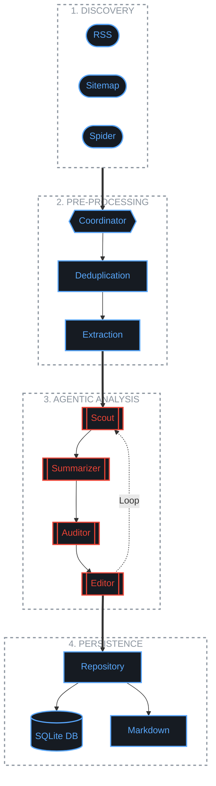

# Unbiased India News - Strategic Roadmap

This document outlines the current production capabilities and future engineering milestones for the Unbiased India News platform.

---

## Technical Pipeline Flow

---

## Current Production Foundations

### Ingestion and Data Quality

- Triple-Track Discovery: Parallelized fetching via RSS, Sitemap XML, and Homepage Spiders.
- High-Volume Scaling: Implementation of semaphores for high-concurrency article processing.
- Deep Extraction: Integrated Trafilatura for sanitized article body retrieval.
- Pre-Clustering Deduping: URL and Title-level filtering to optimize token usage.

### Agentic Intelligence

- Live AI Reasoning: Multi-agent flow utilizing Gemini 1.5 Pro and Flash.
- LLM Caching: Persistence of AI responses via SQLiteCache to minimize operational costs.
- Rate Limiting: Concurrency management via global semaphores to ensure API stability.
- State persistence: Asynchronous LangGraph checkpointing for workflow recovery.

### Engineering and DevOps

- Dockerization: Multi-stage, CPU-optimized container builds using Python 3.12.
- Universal Configuration: Centralized YAML management with environment variable overrides.
- CI/CD: Automated GitHub Action workflows with HuggingFace model caching.

---

## Medium Term: Expansion (Q3 2026)

- Regional Sitemap Expansion (Issue #4): Implement sitemap discovery for additional regional languages including Tamil and Telugu.
- Automated Accuracy Evaluation (Issue #5): Integrate a Judge LLM (GPT-4o) into the evaluation suite to provide automated bias scoring benchmarks.

## Long Term: Platform Growth (2027)

- Vector Story Tracking (Issue #6): Implement a vector database (e.g. ChromaDB) to track story evolution over multiple months.
- REST API Layer (Issue #7): Develop a FastAPI-based service to expose daily report data to external frontends.
- Real-time Notifications (Issue #8): Implement an alerting utility for high-priority coverage blindspots.
